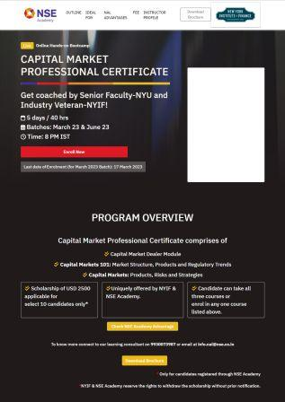

# NSE INDIA CAPITAL MARKET PROFESSIONAL CERTIFICATE COURSE

The project is a website created using HTML, CSS, and JavaScript. The website is designed for CAPITAL MARKET PROFESSIONAL CERTIFICATE.

## Project Completion

The project was completed under the supervision of Abhiyantriki Technology in Bhopal, Madhya Pradesh. 

### Team Members

- Developer:  Gourav Mahobe
- Company: [Abhiyantriki Technology](https://www.abhiyantrikitech.com) , Bhopal MP
- QA Tester: [Angesh Mishra](https://github.com/angesh27)
- GitHub URL: https://github.com/angesh27
- Designer: Sachin Pandey

- With our more team members of Abhiyantriki Technology and NSE Academy
- Company URL: https://www.abhiyantrikitech.com
- Github gnerated page url: https://sachin12031999.github.io/NYIF-Capital_Market_Professional/
- Live project url : https://www.ncfm-india.com/ORE/Think_like_a_CEO/

### Abhiyantriki Technology

For more information on Abhiyantriki Technology, please visit their website at: https://www.abhiyantrikitech.com

## Installation

Do not install the project all right reseved National Stock Exchange of India Ltd. this is only for information purposes.

## Key Features

- Modern and user-friendly design 
- Responsive layout for optimal viewing on all devices
- Developed using HTML, CSS, and JavaScript
- Completed under the supervision of Abhiyantriki Technology
- QA testing by Angesh Mishra

## Description

This project is a dynamic and interactive web application that has been developed utilizing cutting-edge web development technologies such as HTML, CSS, and JavaScript. It is designed with a user-centric approach to offer an intuitive and immersive experience to the end-users.

The web application has been developed under the aegis of Abhiyantriki Technology, a premier technology solutions provider based in Bhopal, MP. The team has meticulously crafted the user interface and user experience design, ensuring that it is both aesthetically pleasing and highly functional.

The quality assurance of the project has been overseen by the proficient expertise of Angesh Mishra, who has worked diligently to ensure that the project is bug-free, efficient, and optimized to deliver a seamless user experience.

Overall, this project exemplifies the commitment of Abhiyantriki Technology to provide innovative, state-of-the-art technology solutions that meet the evolving needs of its customers.

## Screenshots

  

## Author

- Sachin 
- Another github: https://github.com/aytsachin

## Contributing

Contributions are welcome. For major changes, please open an issue first to discuss what you would like to change.

